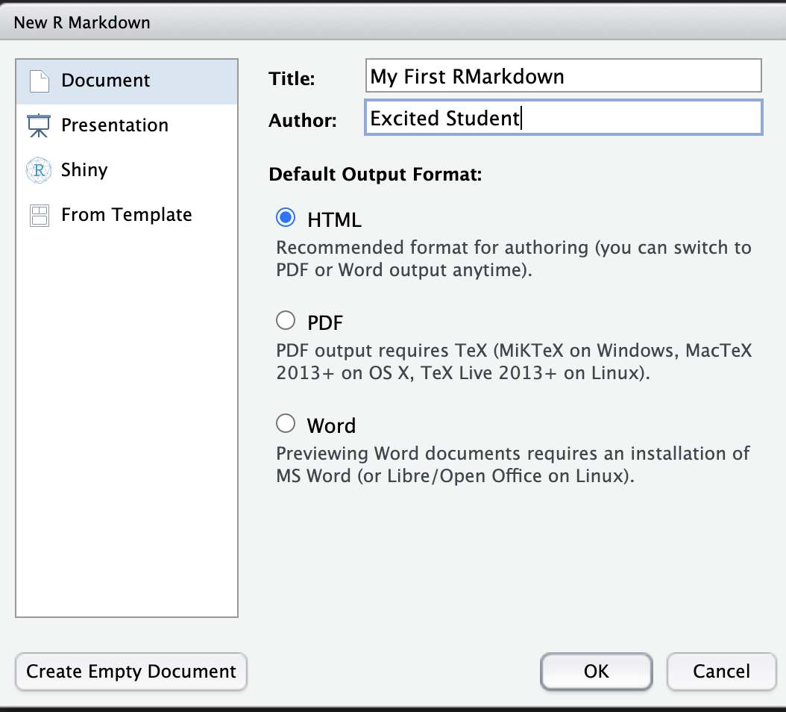

```{r python+r set-up}
library(reticulate)
library(tidyverse)
reticulate::py_available()
```
# Example from the finance industry
## Monte Carlo (MC) Options Pricing
- Using arbitrage pricing theory, the option price is equal to the expected payoff $V$ discounted by a factor $D$ which can be evaluated via MC method.
The Monte Carlo estimator of option price is given by
$$C_0=D \times \frac{1}{N} \sum_{\omega \in sampleset}V(\omega)$$
where N is the number of sample paths (simulations)

1. The simulation of each price path is independent of other paths, therefore it is easy to parallel process the simulation of different paths on different computing nodes
2. It is a task-parallel in the sense that simulations of each path is a small task.  However it is not data-parallel since there is no data set to be distributed to different computing nodes.
3. The scalable benefit is improved price accuracy as $N$ increases, the error reduction being approximately $1/\sqrt{N}$

---
class:middle
# Example from the finance industry
#####.heat[Backtesting Investment Strategies]

.pull-left[
#### Task-parallel backtesting
- Suppose you need to backtest a basket of different investment strategies to identify the optimal strategies
- The process of each investment strategy is independent of each other and can be run simultaneously.
- Distributing the processing of different strategies to different computing nodes is an *embarrassingly parallel* and *task parallel* implementation.
]
.pull-right[
#### Data-parallel backtesting
- Backtesting on one strategy can also be implemented as *data parallel*
- By generating subsamples from test data set(e.g. by bootstrapping), strategy can be processed on different subsamples simultaneously
- The results on different subsamples is then aggregated to generate the performance and risk report of the strategy
]
---
class:middle
## Business reporting in `r fa('r-project')` for the `r fa(name = "user-ninja")` user
.pull-left[

###&nbsp; R Markdown can be used to create: 

- Reports (HTML, PDF, Word)
- Slide Decks (HTML, PowerPoint)
- Web Apps
- Web Pages
- Books
- It is part of the `tidyverse` package


]
.pull-right[ 
### Your turn
- Go to server, login in and create new session
- Create a `RMarkdown` file by *File > New File > R Markdown*


]

---
class:middle
### R Python Interface the `reticulate` package

- In your `Rmd` file, insert a `R code chunk` by clicking Insert and selecting R 
- `r fa('windows')` **Ctrl+Shift+i**
- `r fa('apple')` **Cmd+Shift+i**

```{r python+r set-up}
library(reticulate)
```
- Can you insert a `python` code chunk and tell it to print "Hello World"?
--

```{python}
print("Hello World")
````

---
class:middle
# Improving computational performance

- There is a commonly held misconception that both Python and R are relatively slow programming languages and not appropriate to implement computationally demand tasks in finance.
- This criticism stems from the fact that most financial algorithms require loops and loops are slow on interpreted languages such as R and Python.
- Traditionally C or C++, which are compiled programming languages, have been used to speed up loops. 

---
class:middle
# Performance Python
```{r xaringan-tachyons, echo=FALSE}
xaringanExtra::use_tachyons()
```
- We will consider a number of approaches to speed up typical tasks and algorithms often encountered in finance including:
.bg-gold[
1. **Vectorisation**<br>Making use of Python's vectorisation which can effectively remove a loop structure of a problem
2. **Dynamic Compiling**<br> Using the `Numba` package allows dynamic compilations of pure Python code using [LLVM technology](https://llvm.org/)
3. **Static Compiling**:<br> `Cython` is not only a Python package but a hybrid language that combines Python and C.
4. **Multiprocessing**:<br>Finally we can excute the code in parallel using the `multiprocessing`Python package
]
---
class:middle
# Loops in Python

.panelset[
.panel[.panel-name[Explanation]
- We will start by creating a simple function in Python
- The task is to draws a certain number of random variables and return their average
- Imaginatively, we will call the function `average_py()`

]
.panel[.panel-name[Python Code]

```{python}
import random
from time import process_time
def average_py(n):
  s = 0
  for i in range(n):
      s +=random.random()
  return s/n
```
]

.panel[.panel-name[Output]
```{python}
t_start=process_time()
n=1000000
average_py(n)
t_end=process_time()
print("Elapsed time in seconds:",t_end-t_start)
```

]
]
---
class:top
# Loops using `Numpy`
.panelset[
.panel[.panel-name[Explanation]
- The strength of `Numpy` lies in its vectorisation capabilities.
- Formally, loops vanish on the Python level
- The looping takes place one level deeper based on optimising and compiling routines provided by `Numpy`
- The function `average_np()` makes use of these

]
.panel[.panel-name[Python Code]

```{python}
import numpy as np
def average_np(n):
  s = np.random.random(n)
  return s.mean()
```
]

.panel[.panel-name[Output]
```{python}
t_start=process_time()
n=1000000
average_np(n)
t_end=process_time()
print("Elapsed time in seconds:",t_end-t_start)
```

]
.panel[.panel-name[Vectorisation and Memory]
- The speedup in vectorisation is considerable, almost a factor of 5.
- However this comes at a price of significantly higher memory usage
- The reason is that `Numpy` attains speed by preallocating data that can be processed in the compiled layer.

]
]
---
class:top
# Monte Carlo Simulation in Finance
- As noted earlier, Monte Carlo simulation is an indepensible numerical tool on quantitative finance.
- Banks and other financial institutions using it for pricing and risk management purposes. 
- It is one of the most powerful, flexible, but computationally demanding methods in quantitative finance. 
- This demand has only increased since Basel III, as banks and financial institutions are required to pricing and hedge counterparty risk of complex derivatives.
---
class:top
# Monte Carlo Simulation of Stock Prices
.panelset[
.panel[.panel-name[Explanation]
- In derivative pricing it is standard practice to simulate a set of discrete time series paths for the value of a stock
- We can create a hybrid MC simulator by implementing a Python loop on `ndarray` objects.
- As before we will then use this function, mcs_simulation_py(), to benchmark execution time across a number of performance enhancing approaches.
- Specify, this function simulates geometric Brownian motion price paths using Equation 10-2. in Hilpisch (2018) "Python for Finance".
]
.panel[.panel-name[Python Code for MC simulator]

```{python}
import math
S0=36.
T=1.0
r=0.06
sigma=0.2
def mcs_simulation_py(p):
  M,I = p # M= number of time intervals for discretisation. I = number of paths to simulate. 
  dt = T/M
  S = np.zeros((M+1,I))
  S[0]=S0
  rn = np.random.standard_normal(S.shape)
  for t in range(1,M+1):
    for i in range(I):
      S[t,i] = S[t-1,i]*math.exp((r-sigma**2/2)*dt+sigma*math.sqrt(dt) *rn[t,i])
  return S
```
]

.panel[.panel-name[Execution for MC simulator]

<!-- reticulate::source_python('mcs_simulation.py') -->


```{python}
t_start=process_time()
I=1000
M=100
S = mcs_simulation_py((M,I));
t_end=process_time()
```
```{python}
print("Elapsed time in seconds:",t_end-t_start)
```


]
.panel[.panel-name[Plot 1000 Price Paths in R]
.pull-left[
- `reticulate` allows you to pull objects back into `R` using the `py$OBJECT_NAME` convention.
```
py$S %>% 
  as_tibble() %>%
  mutate(t=row_number()) %>%
  gather(Path,Price,-t) %>%
  ggplot(aes(x=t,y=Price,colour=Path)) + 
  geom_line() +
  theme(legend.position = "none") +
  labs(y="Simulated Prices")
```
]
.pull-right[
```{r plot_python_object, echo=FALSE, fig.retina=3,fig.height=6}
py$S %>% 
  as_tibble() %>%
  mutate(t=row_number()) %>%
  gather(Path,Price,-t) %>%
  ggplot(aes(x=t,y=Price,colour=Path)) + 
  geom_line() +
  theme(legend.position = "none") +
  labs(y="Simulated Prices")
```
]
]
]
---
class:middle
# MC simulator using `Numpy`
.panelset[
.panel[.panel-name[`Numpy` Version]
- The below python code is very similar to the previous except for the highlighted line

```{python}
def mcs_simulation_np(p):
  M,I = p
  dt = T/M
  S = np.zeros((M+1,I))
  S[0]=S0
  rn = np.random.standard_normal(S.shape)
  for t in range(1,M+1):
    for i in range(I):
      S[t,i] = S[t-1,i] * np.exp((r-sigma**2/2) * dt + sigma * math.sqrt(dt) * rn[t,i]) 
  return S
```
]
.panel[.panel-name[Execution time for MC simulator]

```{python}
t_start=process_time()
S = mcs_simulation_np((M,I))
t_end=process_time()
```

```{python}
print("Elapsed time in seconds:",t_end-t_start)
```

- In this instance this is not faster than the base Python code.

]
]

---
class:top
# MC simulator using `Numba`
.panelset[
.panel[.panel-name[numba simulation]

```{python}
import numba
mcs_simulation_nb=numba.jit(mcs_simulation_np)
```
]
.panel[.panel-name[first run]
### This call includes the compile time overhead

```{python}
t_start=process_time()
S=mcs_simulation_nb((M,I))
t_end=process_time()
print("Elapsed time in seconds:",t_end-t_start)
```
]
.panel[.panel-name[second run]
### This call excludes the compile time overhead

```{python}
from time import process_time
t_start=process_time()
S=mcs_simulation_nb((M,I))
t_end=process_time()
print("Elapsed time in seconds:",t_end-t_start)
```

- After compilation `Numba` is much faster than `Numpy`
]
]
---
class: middle
# Multiprocessing

.panelset[
.panel[.panel-name[Explanation]

- As mentioned before, Monte Carlo simulation is a task that lends itself well to parallelisation.
- It is an *embarrassingly* parallel problem with no information shared across sub Jobs.
- In the example we could parallelise the simulation of 1000 paths into 10 processes simulating 100 paths each.
- .saltinline[On the server students are restricted to one vCPU, so what follows is better run on a local multiprocessor machine]
]
.panel[.panel-name[Parallelisation in Python]

- .saltinline[The following code makes use of the `multiprocessing` module and divides the total number of paths to be simulated into small chunks of size $I/p$, where $p>0$]

```{python}
import multiprocessing as mp
pool = mp.Pool(processes=8)
p=10
```

- .saltinline[After all the single tasks are finished, the results are put together in a single `ndarray` object using `np.stack`]

```{python}
t_start=process_time()
S= np.hstack(pool.map(mcs_simulation_np,p*[(M,int(I/p))]))
t_end=process_time()
print("Elapsed time in seconds:",t_end-t_start)
```

- .heatinline[In this instance there is no more speed-up to be observed.]
]
]
